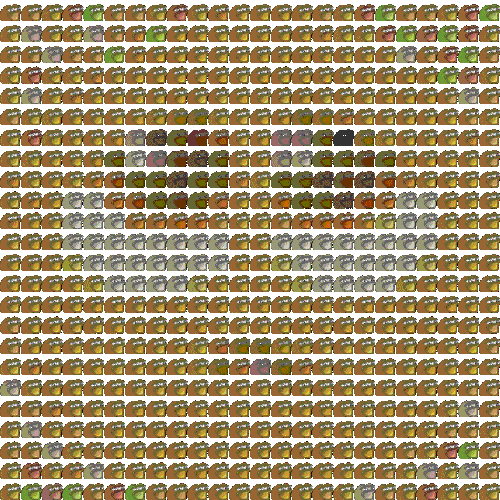

# Emojify Image
[](https://github.com/psf/black)

Render a PNG or GIF using smaller GIF's as pixels, such as animated emojis.

These are examples created using Discord emojis. Try toggling your GitHub theme for a better view.




## Requirements

- Python 3.7+
- Pillow

```sh
pip install -r requirements.txt
```

## Usage

```sh
# Generate a GIF using PNG as input
python3 emojify.py image.png emoji.gif

# Generate a GIF using GIF as input
# Without it, the input GIF is treated like a still image
python3 emojify.py image.gif emoji.gif --use-gif

# Number of emojis per line/row
# Default: 64
# - Increase this to make the output "less pixelated"
python3 emojify.py image.png emoji.gif --per-line 128

# Pixel width of GIF output
# Default: 1024
# - LARGE NUMBERS MAY SLOW OR CRASH YOUR SYSTEM
# - Should be divisible by --per-line
python3 emojify.py image.png emoji.gif --width 2048

# Milliseconds delay between GIF frames
# Default: 45
python3 emojify.py image.png emoji.gif --delay 30
```

